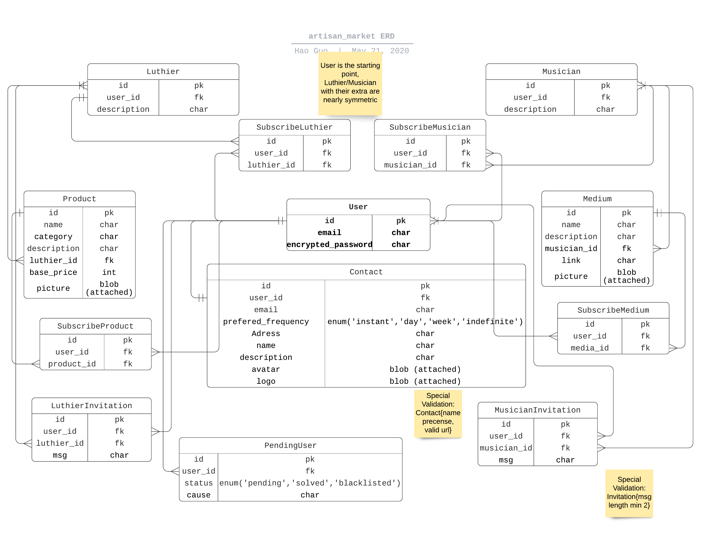
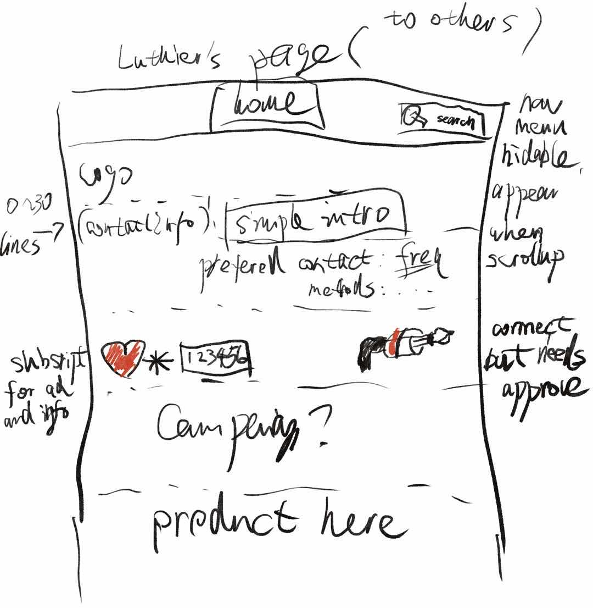
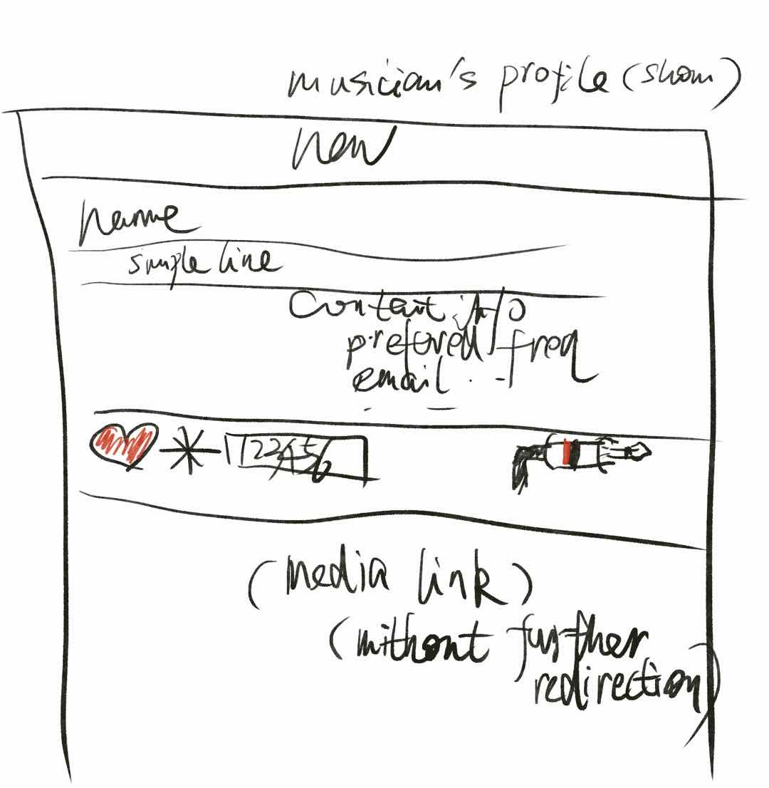
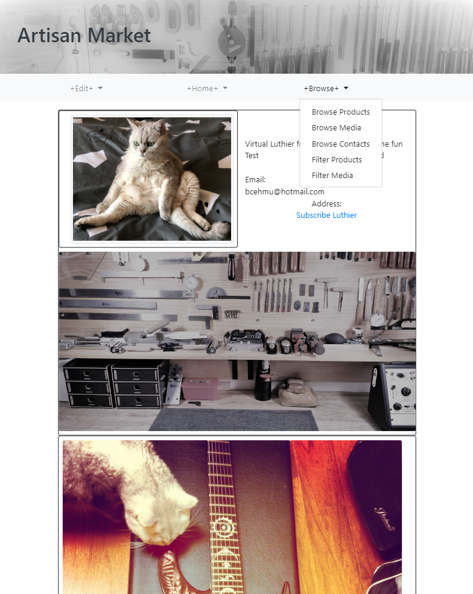

# [Artisan Market](https://shrouded-wave-42515.herokuapp.com/)


## Purpose

Luthiers try to provide high quality and customizable instruments.
Musicians are good at making media promoting instruments.
This project is to explore a way to bridge between custom guitar/bass luthier and musician.
- The market of custom instrument luthier and musician is not a large one.
Usually mass-production products sacrify some degree of quality to efficiency and targeted consumers' population, but custom instrument market is usually not considered of this type.
- In this market, a deal means a long process of communication, takes months or even years to finish.
- Important factors include building reputation and proper communication. 

## Problems to be solved

In the age of internet, messaging is fast and cheap, but building healthy industrial ecology could be misled by fast expansion.
The project author has some custom guitars ordering experience and certified basic guitar maintenance ability, enjoy custom guitar/bass for its quality and opportunity to learn from luthiers. But to understand what is luthier's major concern, author discussed with luthier friend specific for this project, with following ideas formed afterwards:
- For a relative small market as custom instrument, participants need to be responsible for their communication as well as their works. Meticulous invitation for new user to be granted role of market player is a good way of healthy expansion. Immoral market player is the poison to be guarded against.
- Subscribing functionality is good for subscriber's efficiency and player's potential campaigns.
- Basic functionality are needed: editing profile, editing products' info for luthiers and editing media info for musicians, browse and search for all users. 

## Target audience

- For luthiers who would like to show their products and communicate with other luthiers and musicians, as well as looking for potential musical promotion with musicians.
- For musicians who would like to show their media and communicate with other musicians and luthiers, searching for potential custom guitar/bass to order, as well as opportunity to profit from promoting luthier's products.
- For others who would like to know more about luthiers' or musicians' work.

## Features

Three types of roles after registration, user (not luthier or musician), luthier and musician, exclusively.
Each with specific accessibility: 
- Every role could browse and search, editing profile, subscribing luthiers/musicians/products/media.
- User could apply for role as luthier or musician, by invitation from other luthier or musician, through entering invitation code.
- Luthier and musician are nearly symmetric, they could edit their own products/media, add or delete non-occupied invitation code.
- Partials (some part of layout and components) such as buttons and menus are designed for current role as well.

## Tech stack

- Ruby on Rails, Postgresql as database
- [devise + cancancan + rolify]([https://](https://github.com/RolifyCommunity/rolify/wiki/Devise---CanCanCan---rolify-Tutorial)) for authentication and authorization
- [pg_search](https://github.com/Casecommons/pg_search) for filter/search functionality
- [Bootstrap](https://getbootstrap.com/) for front-end styling
- [AWS S3](https://aws.amazon.com/) for media storage
- [Heroku](https://www.heroku.com/) for deployment

## App structure

### Ruby on Rails for MVC
- Mostly following rails convention for MVC structure.
- Models: User, Luthier, Musician, Product, Medium, Contact, SubscribeLuthier, SubscribeMusician, SubscribeProduct, SubscribeMedium, LuthierInvitation, MusicianInvitation. With User model as the center, Luthier and Musician and following are nearly symmetric.
- Controllers and Views are created as needed. Except Filters controller, all controllers have corresponding models and conventional views needed. The Filters controller is for search functionality, redirecting to show the result in other controllers' views without saving related search data.
- One special use is for invitation, Luthier and Musician edit invitations rendering under invitations' controllers and views, User applying for Luthier or Musician rendering invitations' controllers' #edit actions instead of #new action, which lead to checking logic in #update action. Unmatched input of invitation code is not saved and not being granted for luthier/musician role.

### Database structure

- User model is the starting point and center of data structure.
Contact model could be understand as extra info of User, but keeps User model cleaner, 'belongs_to' User, which 'has_one' contact.
- Luthier and Musician, with each appending extra models such as LuthierInvitation/MusicianInvitation, Product/Medium, mostly symmetric, Luthier's in one side and Musician in the other. Luthier/Musician 'belongs_to' User and has one-to-one relationship with User.
- Luthier and Musician models are seperated from User model, considering they need different features for views and controllers, and could make models cleaner.
- Subscribe related models are simple and uniformly defined, with 'user:references' pointing to subscriber's user_id, the other pointing to the instance subscribed, luthier/musician/product/medium. This allows subscribe within same kind, for example, luthier subscribing to another luthier.
- Product is the work of Luthier, Medium is the work of Musician, simple relationships with 'belongs_to' and 'has_many', similarly with LuthierInvitation and MusicianInvitation models.


## Wireframe

### Initial wireframe




## Screenshot


## Third-party services

### User authentication with [devise](https://github.com/heartcombo/devise)
devise is used for user authentication.
- devise provide powerful and efficient way to add authentication to app.
This project depends on devise for user resgistration/login/password functions,
with only minor customizing style of generated views of devise.
The most critical method deciding current role for authorization is heavy use of devise helper:
```ruby
current_user
```
Authentication with helper:
```ruby
before_action :authenticate_user! 
```

- To add specific data-accessing controller, rolify and cancancan could be utilized by resourcify specific models, adding 
```ruby
resourcify
```
in model class.
rolify and cancancan don't automatically create data-accessing controller, but provide helpers for easier managing customized logic of data-acessing.

### Search/Filter with [pg_search](https://github.com/Casecommons/pg_search)

pg_search is a tool taking advantages of PostgreSQL's search for ruby.
- This project use pg_search's pg_search_scope method to search against products' and media's content, with ability to negate-search using :tsearch, which is a Full text search built-in to PostgreSQL.
To search in specific model's data, for example adding
```ruby
  include PgSearch::Model
  pg_search_scope :search_medium, against: [:name, :description], using: {
    tsearch: {negation: true}
  }
```
in Medium's model class, enabling search against medium's name and description.
A method :search_medium is created and ready to be used in Medium's controller
```ruby
      @filter = params["search"]
      @media = Medium.all.search_medium("#{@filter}")
```
Here @media is filtered by search_medium method.

### Easy styling with bootstrap
After several lines of initial configuration, bootstrap's styling tool could be easily used by adding predefined class name to html element for styling.
- This project didn't touch heavily about styling, most heavy use of bootstrap is grid for layout. For example
```html
<div class="container">
    <div class="row justify-content-between">
        <div class="col">
        </div>
        <div class="col">
        </div>
    </div>
</div>
```
Bootstrap's class "container" and "row" "col" arrange layout like a grid and automatically align with option such as "justify-content-between" "justify-content-around".
- Currently image was sized by bootstrap class "img-thumbnail" and "img-fluid" .
- Navbars with drop-down menu are created using bootstrap as well. To function well, properly nested structure guidedy by official document is necessary.

## Tasks Planning and Tracking
- This is a student assignment project of CoderAcademy in mid 2020, with 2 weeks time to plan and develop.
- [Trello board](https://trello.com/b/653aWeq1/artisan-market) is used to plan and track along the process, and is the first step to start.
- Discussion with luthier about concerns of this specific tool is conducted in the begining well, to understand the some aspects of pain points of current industry from luthier's view. 
- ERD at the begining consisted of User,Contact,Luthier,Musician, Product,Medium and related Subscribe* models with their relationships, with the idea of keeping data schema clear and expandable in mind after reading several articles about good practice of data schema design. This project choose to use smaller tables instead of larger table of mixed info. Although in current models, Luthier and Musician with their relatives are near symmetric, but they could be added with specific features later independently. 
- The Invitation part of ERD was added later when solution came clearer. Invitation part is a special but critical feature of this market type from author's view. 
- Wireframes about sitemap was vaguely formed before ERD but more clearly designed after hand-drawing ideas with ipad (Procreate app). 
- Documentation through the whole process, beyond this README file, all of essential commands and links were recorded. ERD was lightly corrected for redundancy or naming convention during the coding.
- Last part before submission assignment was about refactoring code, refining documents.

## Configuration notes:

### Use deivise + cancancan + rolify

After adding devise, cancancan, rolify in Gemfile,
```bash
rails g devise:install
rails db:migrate
```
(Edit relative files hinted by devise:install's output)
```bash
rails g devise User
rails g cancan:ability

rails db:migrate
```


```bash
rails g rolify Role User
```
But at this point if run migration directly, there might be an error about migration, with [solution from rolify community](https://github.com/RolifyCommunity/rolify/issues/444)
Following the article, edit version info in migration file of rolify Roles to [5.0].

```bash
yarn add rails-ujs
```

### Heroku deployment
- Use rails credentials to save protected info.
Rails credentails could be checked in rails console by using
```bash
Rails.application.credentials
```
For linux users, editor of credentials file could be achieved by
```bash
EDITOR=nano rails credentials:edit
```
For windows users, editor could be set by
```bash
set EDITOR="notepad"
```
Editing by
```
rails credentials:edit
```
The recognizable format of credentials is **strict**, improper spaces or tab could **not** be interpretted.

- Use "heroku run" command helper to excute on server
As guided by heroku, following commands are necessary for successful deployment after login/create/push and editing credential:
```bash
heroku run rails db:reset
heroku run rails db:setup
heroku run rails db:migration
heroku run rails db:seed
```

## References
- [The deployed site at Heroku](https://shrouded-wave-42515.herokuapp.com/)
- [ERD](https://app.lucidchart.com/invitations/accept/a5f8eeda-5c7e-4930-9a24-e9fbbd283dea)
- [GitHub Repository](https://github.com/bcehmu/artisan_market)
- [Trello board](https://trello.com/b/653aWeq1/artisan-market)


